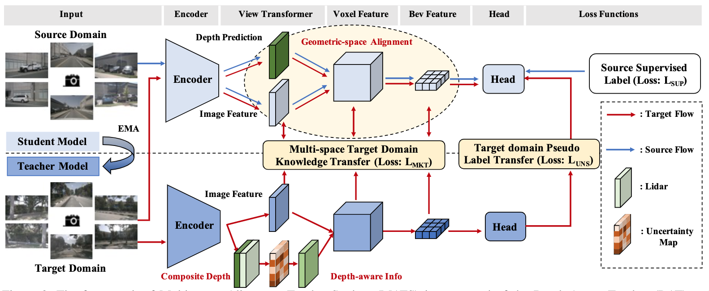
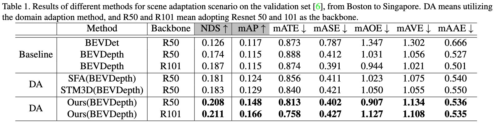
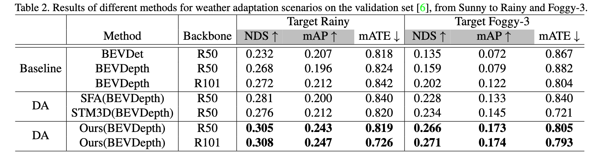
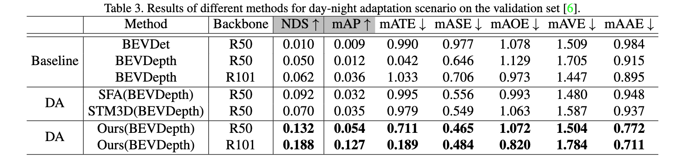
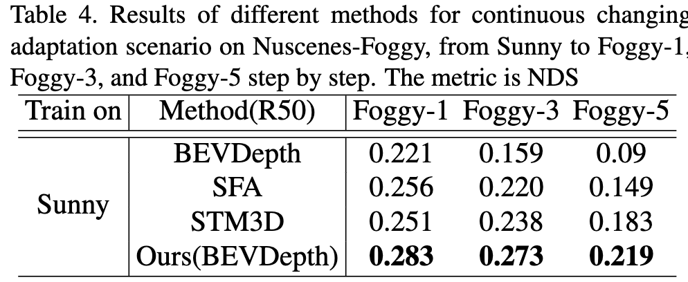

## Multi-geometric Space Alignments for Domain Adaptive Multi-view 3D Object Detection

The framework of Multi-space Alignment Teacher-Student (MATS) is composed of the Depth-Aware Teacher (DAT) and Geometric-space Aligned Student (GAS) model. In \textbf{the bottom part}, the DAT model takes target domain input and adopts depth-aware information to construct Voxel and BEV features with sufficient target domain knowledge, which is further transferred to the student model in the multi-latent space (i.e., 2D image, 3D voxel, and BEV). In \textbf{the upper part}, the GAS model takes two domains input and decreases data distribution distance in a shared geometric embedding space. MATS framework aims to comprehensively address the multi-geometric space domain shift accumulation problem.

## 1. More comprehensive Quantitative Analysis

### 1.1 From Boston to Singapore

### 1.2 From Clear to Rainy or Foggy

### 1.3 From Day to Night

### 1.4 Continues Changing Adaptation

We set clear weather data as the source domain and set continuously increased foggy degree data as the target domain. Specifically, we realize UDA from sunny to Foggy-1, Foggy-3, and Foggy-5 step by step with the degree of fog increased. Since the continually changing domain gap usually appears in autonomous driving, it is essential to address the domain shift problem.

As shown in this table, along with the increased foggy degree, the baseline method shows an obvious performance degradation. However, MATS alleviates the gradually increased domain gap and outperforms the baseline method and STM3D by 12.3\% and 3.6\% NDS in the final Foggy-5 domain. The results prove that our method also can avoid the error accumulation caused by continually changing domain shift.
