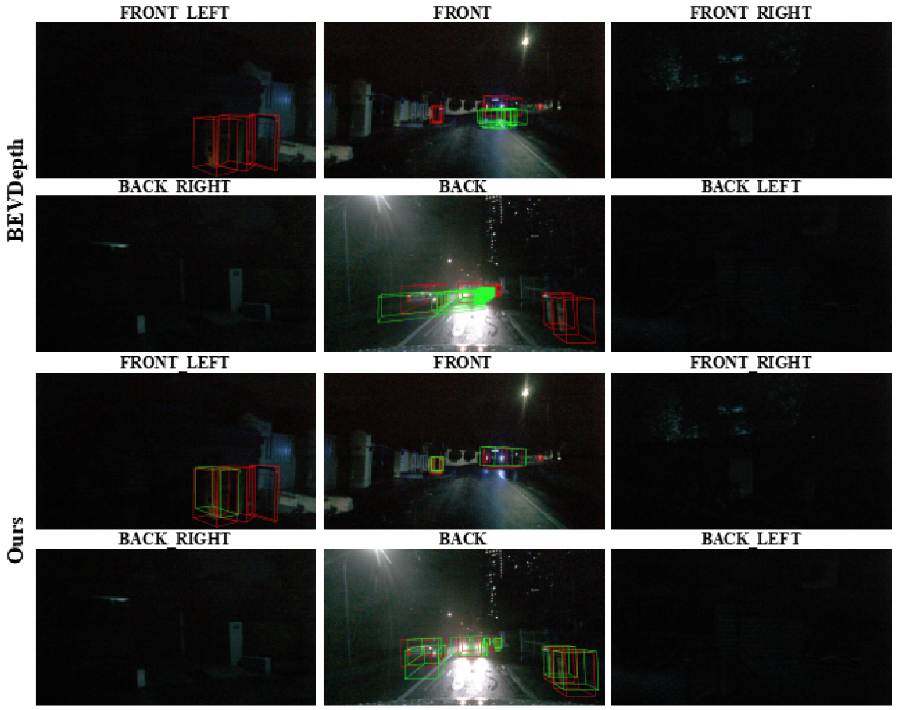
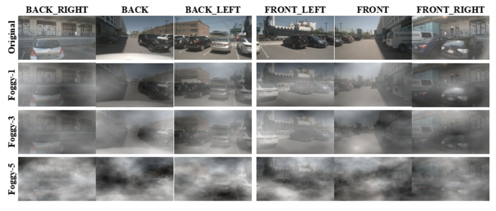
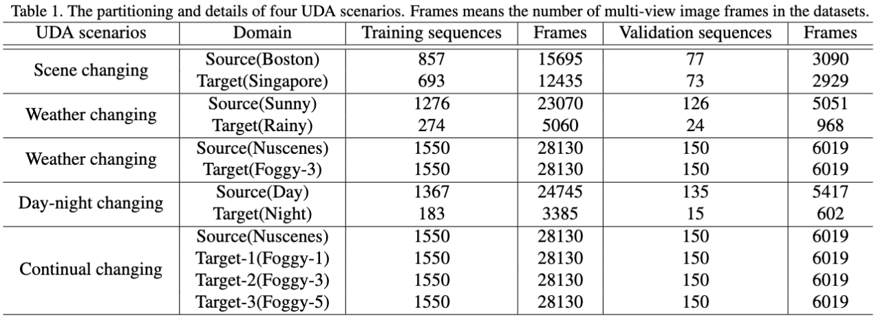

## Multi-geometric Space Alignments for Domain Adaptive Multi-view 3D Object Detection

The framework of Multi-space Alignment Teacher-Student (MATS) is composed of the Depth-Aware Teacher (DAT) and Geometric-space Aligned Student (GAS) model. In \textbf{the bottom part}, the DAT model takes target domain input and adopts depth-aware information to construct Voxel and BEV features with sufficient target domain knowledge, which is further transferred to the student model in the multi-latent space (i.e., 2D image, 3D voxel, and BEV). In \textbf{the upper part}, the GAS model takes two domains input and decreases data distribution distance in a shared geometric embedding space. MATS framework aims to comprehensively address the multi-geometric space domain shift accumulation problem.

## 1. More comprehensive Quantitative Analysis

### 1.1 From Boston to Singapore

### 1.2 From Clear to Rainy or Foggy

### 1.3 From Day to Night

### 1.4 Continues Changing Adaptation

We set clear weather data as the source domain and set continuously increased foggy degree data as the target domain. Specifically, we realize UDA from sunny to Foggy-1, Foggy-3, and Foggy-5 step by step with the degree of fog increased. Since the continually changing domain gap usually appears in autonomous driving, it is essential to address the domain shift problem.

As shown in this table, along with the increased foggy degree, the baseline method shows an obvious performance degradation. However, MATS alleviates the gradually increased domain gap and outperforms the baseline method and STM3D by 12.3\% and 3.6\% NDS in the final Foggy-5 domain. The results prove that our method also can avoid the error accumulation caused by continually changing domain shift.

## 2. More Qualitative Analysis

Visualizations of our method benefit. The upper and bottom parts are visualization of BevDepth and our proposed method, respectively.

In contrast with the visualization on submission, we further present some visualization results of the prediction produced by the MATS and the baseline BEVDpeth on the most challenging scenario (day-night), as shown in this Figure. Due to the faint light of night-time data, we can not classify and locate objects even with the naked eye, not to mention camera-based methods. It is quite clear that the BEVDepth has various inaccurate and missing detection, while MATS yields more accurate localization results as its predicted green boxs overlap better with the ground truth red boxs.
We can also observe that MATS can detect objects that baseline ignores, demonstrating the superiority of MATS in object detection and presenting great potential in deploying to real-world autonomous driving. However, our proposed method still has some missing detection which inspires us to pay more attention to the BEV perception at night time.

## 3. Supplementary description of foggy Nuscenes dataset

We apply the fog simulation pipeline [1] to the multi-view images provided in the Nuscenes dataset [2]. specifically, we generate synthetic foggy images for all scenes of training, validation, and test set, which reserve original annotation of 3D object detection task. We utilize five different density degrees of foggy simulator to construct Foggy-Nuscenes dataset, including Foggy-1, Foggy-2, Foggy-3, Foggy-4, and Foggy-5 (gradually increasing fog density). As shown in this Figure, we adopt Foggy-1, Foggy-3, and Foggy-5 as the experimental datasets for weather adaptation and continual changing scenario, which have an obvious domain gap with original Nuscenes dataset. 

[1] Christos Sakaridis, Dengxin Dai, and Luc Van Gool. Semantic foggy scene understanding with synthetic data. International Journal of Computer Vision, 126(9):973–992, 2018
[2] Holger Caesar, Varun Bankiti, Alex H Lang, Sourabh Vora, Venice Erin Liong, Qiang Xu, Anush Krishnan, Yu Pan, Gi-ancarlo Baldan, and Oscar Beijbom. nuscenes: A multi-modal dataset for autonomous driving. In Proceedings of the IEEE/CVF conference on computer vision and pattern recognition, pages 11621–11631, 2020

## 4. Additional details of UDA scenarios

In this paper, we utilize Nuscenes and Foggy-Nuscenes datasets to generate three classical and one continually changing UDA scenarios. As shown in this Table, for the scene changing scenario, we set Boston as the source scene data and realize UDA on the Singapore target domain. The source domain contains 15.6k frames of labeled data and the target domain has 12.4k frames of unlabeled data. For Weather changing scenarios, sunny weather is considered as source domain data, and rainy and foggy weather is considered as target domain data. In the second row, the source domain has 1276 training sequences and the rainy target domain has 274 training sequences. In the third row, we leverage the entire Nuscenes dataset as source domain data and set Foggy-3 as target domain data. As we can see, in Day-night changing scenario, we design daytime data as the source domain and realize UDA on the target domain (night data). Since the source domain data is larger than the target domain data and the camera can not capture night-time data clearly, which is considered as the most challenging adaptation scenario. Finally, we set all Nuscenes sequences as the source domain data and set continuously increased foggy degree data as the target domains. The various target domains are of the same sequence and scene as the source domain, but the different foggy degrees on the frames bring different domain gaps. We introduce this continually changing scenario to demonstrate the continual domain adaptation ability of our proposed method.

